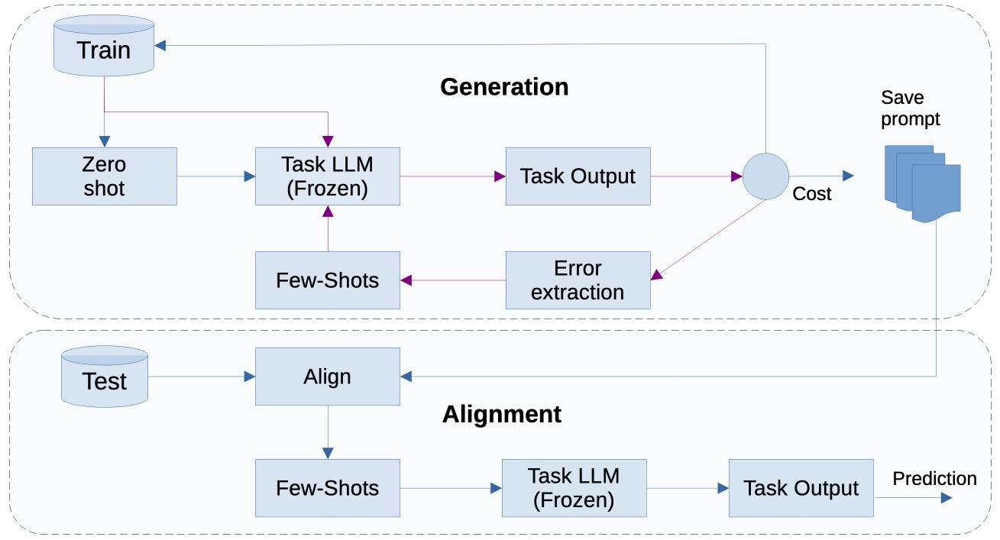

# TermPrompt
## Optimal Prompt Design for Automatic Term Extraction Using Incremental Few-Shot Learning

Prompt engineering is a practical and powerful way to use LLMs. While it has proven effective in many NLP-related applications, some tasks have received much less attention and remain underexplored, especially with respect to in-context learning (ICL). One such task is automatic term extraction (ATE). At present, it remains unclear how to efficiently prompt LLMs for ATE to achieve optimal performance. To address this lacuna and provide a comprehensive evaluation of LLMs for ATE, we introduce TermPrompt, a novel approach that uses incremental few-shot learning to design optimal prompts for ATE. In TermPrompt, LLM errors are used as demonstrations to construct optimal prompts during training. For a given test input, the optimal prompt is selected based on its similarity to the training data. Our proposed learning algorithm can also be applied to other tasks involving in-context learning. 



The **paper** can be found [here](coming soon)

The **poster** can be found [here](coming soon)

When citing **TermPrompt** in academic papers and theses, please use the following BibTeX entry:
```
@InProceedings{TermPrompt,
  author = {Amir Hazem and kyo Kageura},
  title = "{TermPrompt: Optimal Prompt Design for Automatic Term Extraction Using Incremental Few-Shot Learning}",
  booktitle = {Artificial Neural Networks and Machine Learning - {ICANN} 2026 - 35th
                  International Conference on Artificial Neural Networks, Padua, Italy,
                  September 14-17, 2025, Proceedings},
  year = {2026},
  month = {September 14-17},
  address = {Padova, Italy.}
  }
```

## Requirements

## To do:
- 
